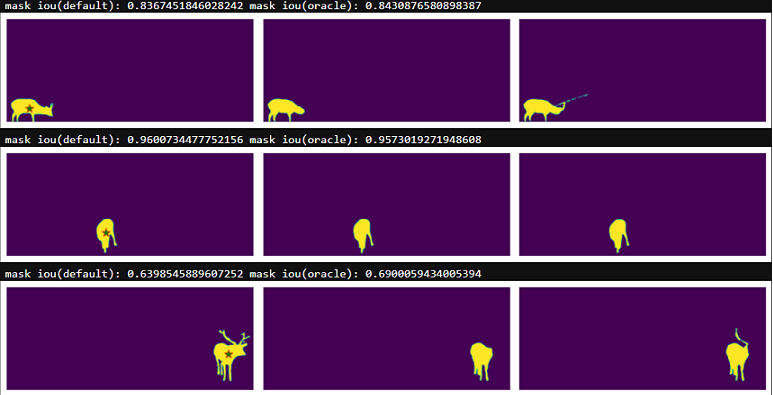

# Evaluation SAM with DSDL



## steps

### 1. install

```
git clone https://github.com/wufan-tb/sam_with_dsdl.git

cd sam_with_dsdl

pip install git+https://github.com/facebookresearch/segment-anything.git

pip install opencv-python pycocotools matplotlib dsdl
```

### 2. prepare dsdl datasets

please visit our [opendatalab](https://opendatalab.com/) platform to download sam evaluation datasets and dsdl files into `./datasets` folder. after downlad and unzip process, the datasets folder should like this:

```
./datasets
├── ADE20K
│   ├── config.py
│   ├── defs
│   ├── README.md
│   ├── set-train
│   ├── set-val
│   └── tools
├── BBBC038v1
├── DOORS
├── DRAM
├── GTEA
├── iShape
├── LVIS
├── NDD20
├── NDISPark
├── OVIS
├── Plittersdorf
├── PPDLS
├── STREETS
├── TimberSeg
├── TrashCan
├── WoodScape
└── ZeroWaste-f
└── ...
```

### 3. download sam model

default or vit_h: [ViT-H SAM model](https://dl.fbaipublicfiles.com/segment_anything/sam_vit_h_4b8939.pth).  

vit_l: [ViT-L SAM model](https://dl.fbaipublicfiles.com/segment_anything/sam_vit_l_0b3195.pth).  

vit_b: [ViT-B SAM model](https://dl.fbaipublicfiles.com/segment_anything/sam_vit_b_01ec64.pth).


### 3. set location config

to evaluate sam with python code, please change location config in `./data_cfgs.json`, you can also read our [tutorials](https://opendatalab.github.io/dsdl-docs/getting_started/quick_start/) to get more details about how to load dataset in python code.

### 4. evaluation sam

```
python evaluation_sa.py
```
notebook users can open `evaluation_sa.ipynb` to read details about evaluation code.